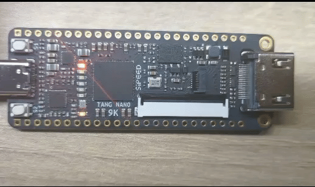
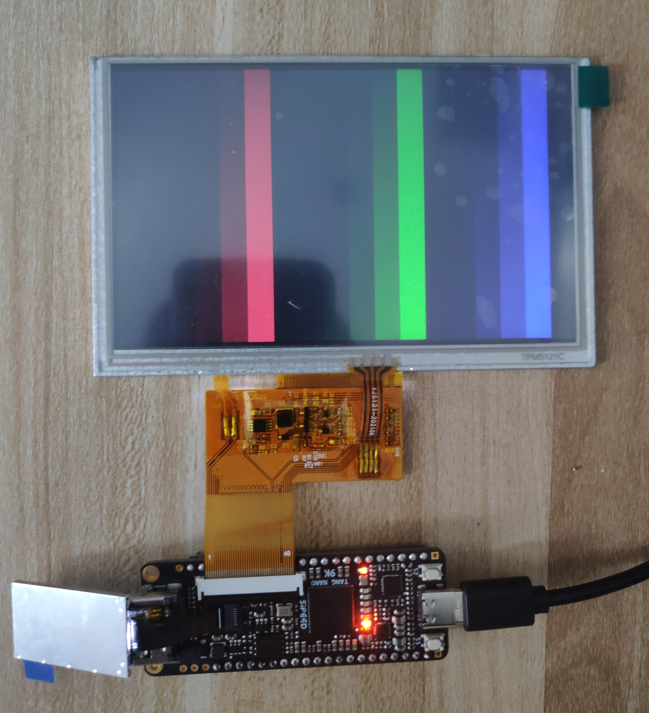
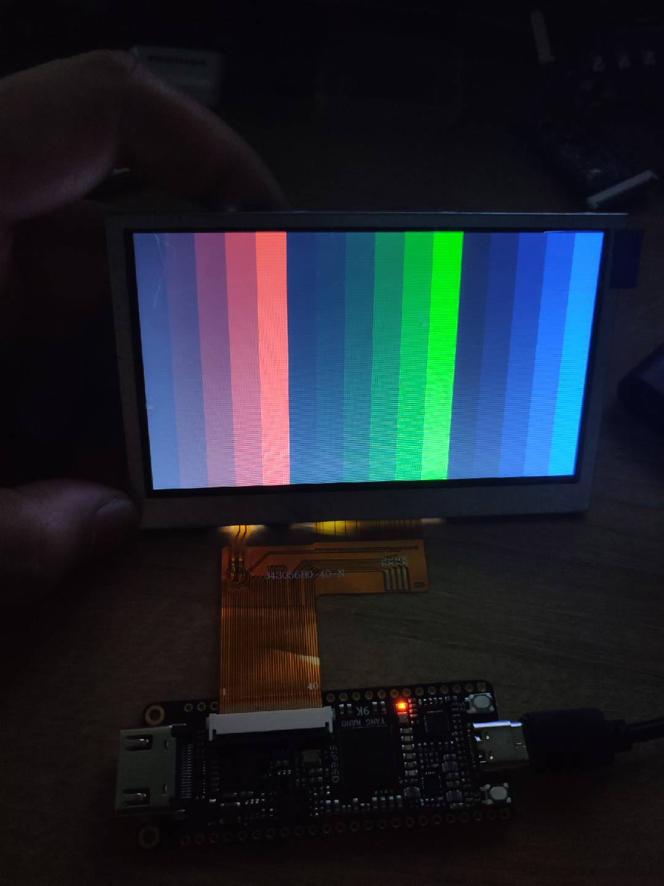
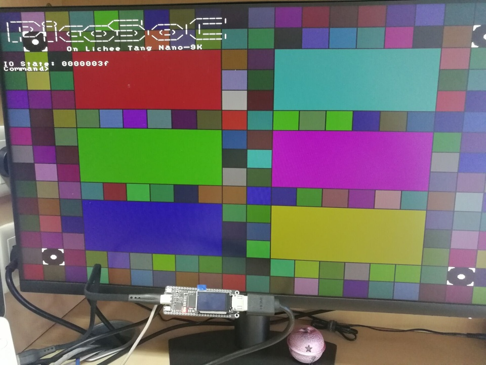
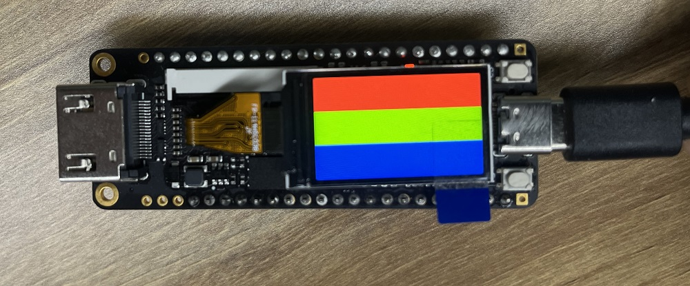

# TangNano-9K-example

- [TangNano-9K-example](#tangnano-9k-example)
  - [Question](#question)
    - [Error Code RP2017](#error-code-rp2017)
  - [Examples](#examples)
    - [led](#led)
    - [lcd\_led](#lcd_led)
    - [lcd\_4.3](#lcd_43)
    - [picotiny](#picotiny)
    - [hdmi](#hdmi)
    - [spi\_lcd](#spi_lcd)
    - [uart](#uart)
    - [Internet\_learning\_resources](#internet_learning_resources)
      - [TangNano9k\_tutorial](#tangnano9k_tutorial)
      - [tangnano9k-series-examples](#tangnano9k-series-examples)

## Question

### Error Code RP2017

When you meet error code `PR2017`. Do what is shown below.(Just enable corresponding IO as regular IO)

## Examples

### led

Demo project for drive LED and on board led.
LED guide is at <https://wiki.sipeed.com/hardware/en/tang/Tang-Nano-Doc/examples.html>

### lcd_led

Demo project for drive RGB LCD and on board led, to drive the 5 inch RGB screen with 800*480 resolution.

### lcd_4.3

Demo project for drive RGB LCD and on board led, to drive the 4.3 inch RGB screen with 480*272 resolution.

### picotiny

A PicoRV32-based SoC example with HDMI terminal from SimpleVout, SPI Flash XIP from picosoc, and custom UART ISP for flash programming. UART baudrate default at `115200`.

See [README.md](picotiny/README.md) for detailed description. 

- Visit https://wiki.sipeed.com/hardware/en/tang/Tang-Nano-9K/examples/picorv/picorv.html to quick run this example
- 中文访问 https://wiki.sipeed.com/hardware/zh/tang/Tang-Nano-9K/examples/picorv/picorv.html 来快速使用

### hdmi

Project based on picotiny example, but all soft_core related codes are removed.

### spi_lcd

This is an example to drive the 1.14 inch lcd screen which can connect with this board.

Be sure match board with screen in the same order

### uart

FPGA uart example, containing 2 uart example messages. Burn into FPGA and open onboard serial port to check the message with 115200 baudrate.

FPGA can not be burned when the serial port is opened.

### Internet_learning_resources

Use command `git submodule --init update` to get the source code.

#### TangNano9k_tutorial

Source link: https://gitee.com/lanzhoo/TangNano9k_Tutorial.git

Step tutorials to build a softcore running via arduino.

#### tangnano9k-series-examples

Source link: https://github.com/lushaylabs/tangnano9k-series-examples

Example codes on Tang Nano 9K, read https://learn.lushaylabs.com/tang-nano-series/ to see the usages.